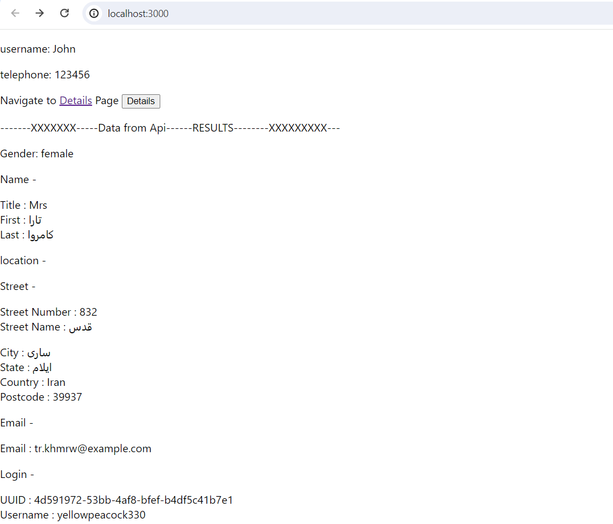
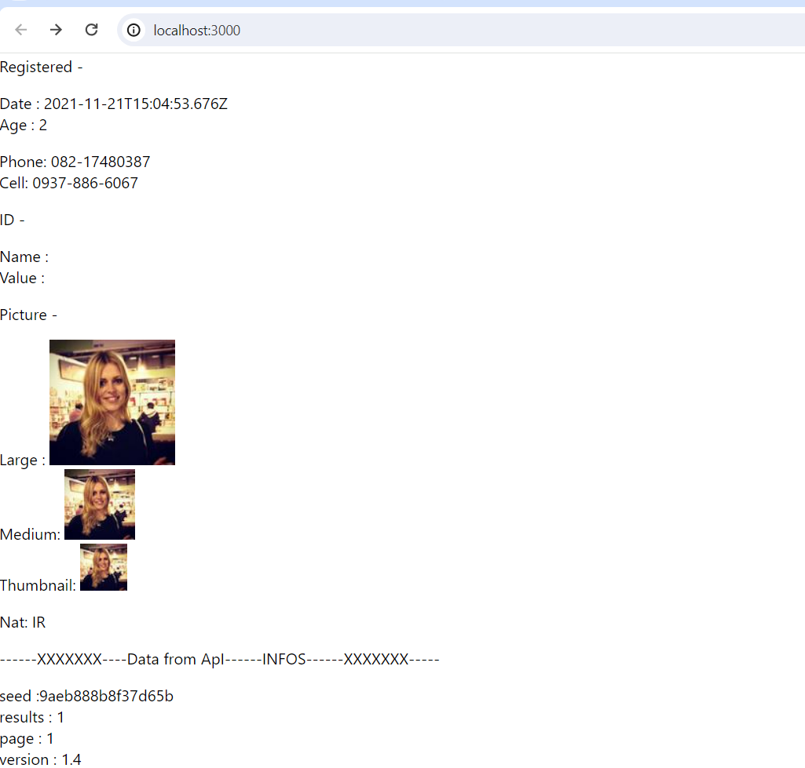

##### DFY_INDIA_REACT_TASK APP

## task - To fetch the data from, API - "https://randomuser.me/api/"  and display the data on Home page, also sisplay the telephone and username variable as same on bot home and details page.

At first, download the repo, and then in your local enviroment, got to this directory, then follow the below steps to run this app in your local machine.

### Step 1: npm install
it will install all dependencies mentioned in package.json file required to run the home page and get display fetched data from api

### step 2: npm start
It will satrt the app locally on url: localhost:3000 

### Issues

During Interview, I dont able to figure out two tasks , below is the answer , how i get solved those 2 issue,

### 1St Issue - Able to fetch data in console but not able to show on home page during interview, below is the solution

I used 

# data.results.map

But i must had to use 

# data.results?.map

the above "?" , ensure that the object results entries fetched out successfuly,

### 2nd issue - Able to print username and telephone on home page but not able to print the same on details page while navigating to details page from home page - below is the solution

At the time of interview i use 

# 
 username: {props.username}  

# 
 telephone: {props.telephone}

But I must had to use 

# 
 username: {props.username ? props.username : "John"}  

# 
 telephone: {props.telephone ? props.telephone : 123456}

The above solution states that if username is not passed as props, then it will set default to John and same for telephone.

#### Screenshot of Home Page: - localhost:3000

#### Screenshot of Details Page: - localhost:3000/student-details